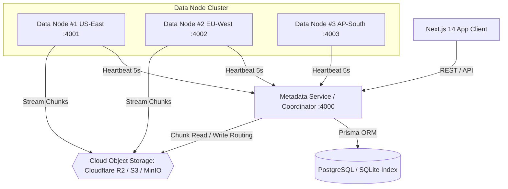

# CloudDFS – A Fault-Tolerant Distributed File Storage System

> A production-grade, portfolio-ready distributed file storage system built with **TypeScript**, **Node.js**, **Next.js**, **Prisma**, and **Cloud Object Storage (Cloudflare R2 / AWS S3)** featuring metadata & data plane separation, chunked uploads, node heartbeat telemetry, and automatic read failover.


---

## 💡 Architecture Overview



---

## ✨ Core Features

- 📁 **Separation of Control Plane & Data Plane**: Metadata (file tree, chunk index, node health) lives in an ACID database; actual file bytes live in Cloud Object Storage.
- ⚡ **Multipart Chunked Uploads**: Files are transparently split into 5 MB chunks, uploaded in parallel, and verified with SHA-256 checksums.
- 💓 **Heartbeat Telemetry & Health Check**: Data nodes send 5-second heartbeats. The coordinator detects node crashes (`UNHEALTHY` > 15s, `DEAD` > 30s).
- 🛡️ **Automated Failover & $N=2$ Replication**: If a primary data node dies, chunk downloads automatically failover to secondary replica storage keys without client disruption.
- 🎛️ **Live Cluster Dashboard**: Real-time admin UI featuring active node metrics, CPU/memory telemetry, under-replicated files counter, and an **interactive "Kill Node" simulation button** for live failure demos.
- ☁️ **Cloudflare R2 / AWS S3 Integration**: Plug-and-play support for Cloudflare R2 free tier, AWS S3, MinIO, or local disk fallback during offline dev.

---

## 🛠️ Monorepo Project Structure

```
clouddfs/
├── apps/
│   ├── web/                 # Next.js 14 App Router Explorer & Admin Dashboard
│   └── server/              # Node.js + Express Metadata Coordinator & Data Node service
├── packages/
│   ├── database/            # Prisma schema, client, SQLite/Postgres configuration
│   ├── storage/             # Cloudflare R2 / AWS S3 wrapper (@aws-sdk/client-s3)
│   └── shared/              # Types, Zod schemas, constants, API contracts
├── docs/
│   ├── ARCHITECTURE.md      # Write path, read path, failover matrix
│   └── DESIGN_DECISIONS.md # CAP theorem trade-offs, chunking rationale
├── docker-compose.yml       # Multi-instance local cluster orchestration
├── .env.example             # Environment configuration guide
└── README.md
```

---

## 🚀 How to Run Locally

### Prerequisites
- Node.js >= 18.0.0
- npm >= 9.0.0

### Step 1: Install Dependencies & Setup Database

```bash
# Install monorepo dependencies
npm install

# Push database schema & seed initial demo data
npm run db:push
npm run db:seed
```

### Step 2: Launch Multi-Instance Cluster

Run the cluster with 2 Data Nodes + Metadata Coordinator + Next.js Web App:

```bash
npm run dev
```

This launches:
- **Metadata Coordinator**: `http://localhost:4000`
- **Data Node 1**: `http://localhost:4001`
- **Data Node 2**: `http://localhost:4002`
- **Next.js Web Explorer & Admin**: `http://localhost:3000`

---

## ☁️ Connecting Cloudflare R2 / AWS S3 (Optional)

Create a `.env` file in the root directory:

```env
# Cloudflare R2 Credentials
S3_ENDPOINT="https://<ACCOUNT_ID>.r2.cloudflarestorage.com"
S3_REGION="auto"
S3_ACCESS_KEY_ID="your_r2_access_key_id"
S3_SECRET_ACCESS_KEY="your_r2_secret_access_key"
S3_BUCKET_NAME="clouddfs-data"
```

*(Note: If no S3 credentials are provided, CloudDFS automatically falls back to an offline local storage buffer, ensuring zero-friction local development!)*

